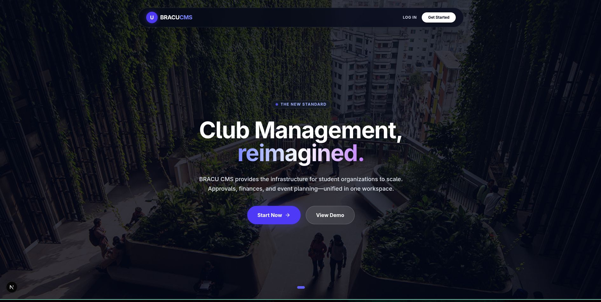
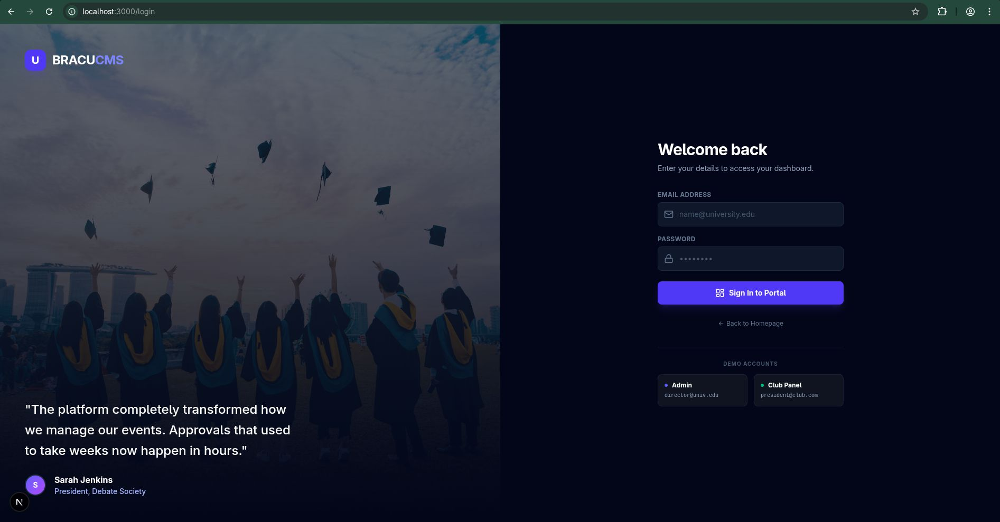
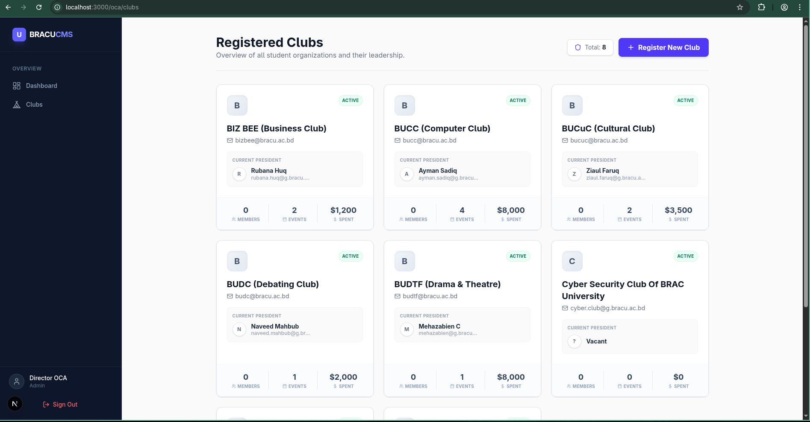
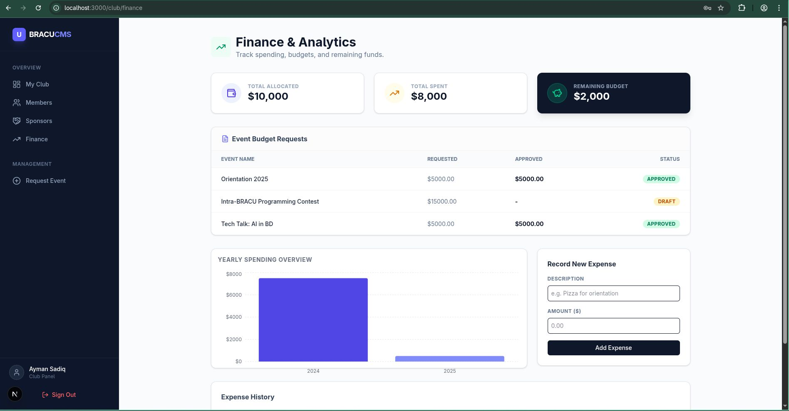
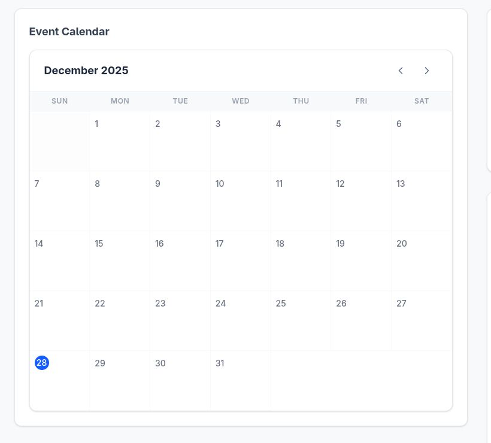
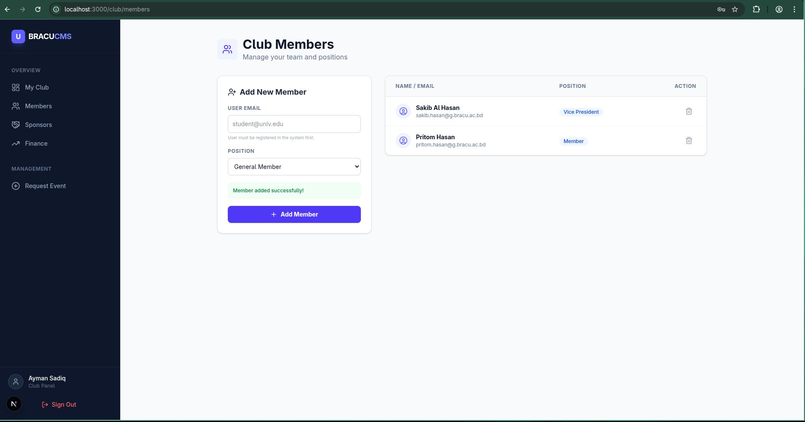
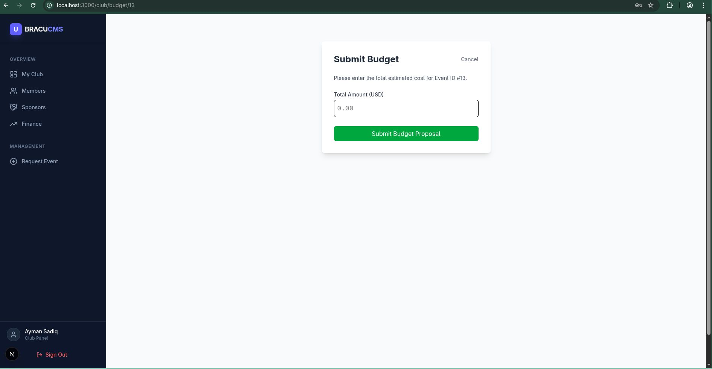
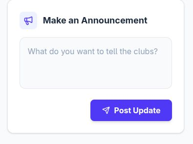
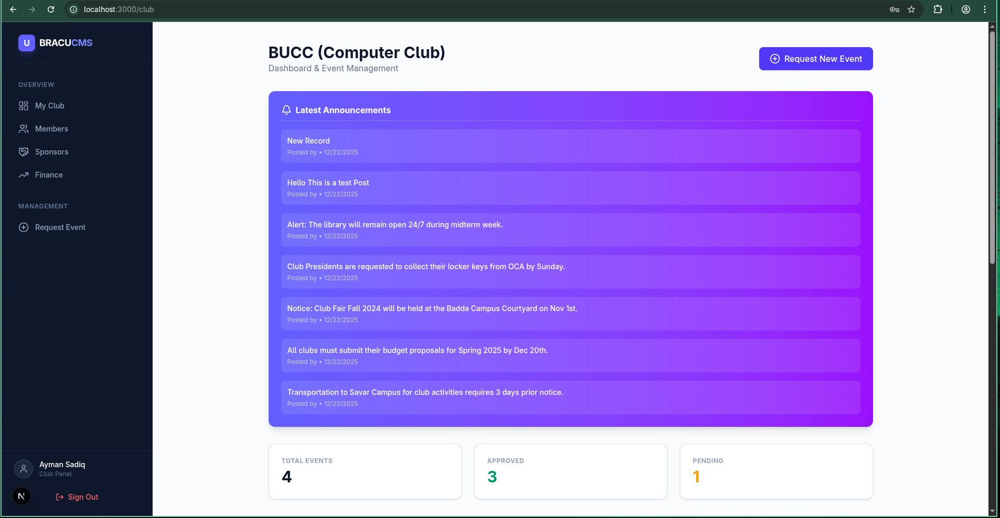
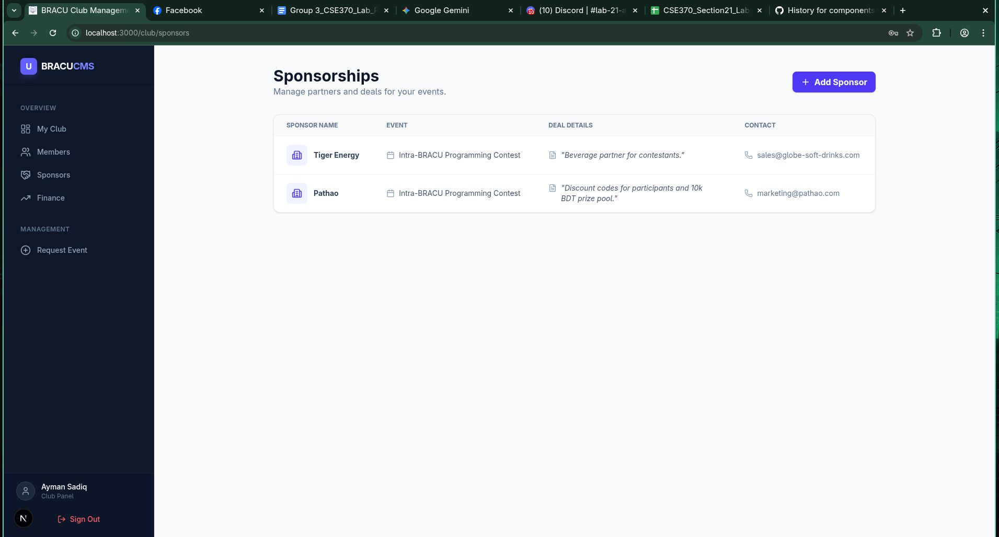

# BRACU Club Management System

> A comprehensive web application for managing club activities, members, and events at BRAC University.

This project is built using **Next.js** and utilizes **raw SQL** commands (via `mysql2`) for high-performance database interactions.

---

## 👨‍💻 Development Team

| Name | Student ID |
| --- | --- |
| **Hasib Hossain Abir** (Team Lead) | `24101236` |
| **Rakat E Jannat Raka** | `24101299` |
| **Ononna Tasnim** | `23201520` |

---

## 🛠️ Tech Stack

* **Framework:** Next.js
* **Database:** MySQL (Raw SQL)
* **Driver:** `mysql2`
* **Language:** TypeScript/JavaScript

---

## 📸 Application Gallery

<details>
<summary><b>Click to expand screenshots</b></summary>


<table>
<tr>
<td align="center">



<em>Dashboard</em>
</td>
<td align="center">



<em>Member Directory</em>
</td>
</tr>
<tr>
<td align="center">



<em>Event Management</em>
</td>
<td align="center">



<em>Profile View</em>
</td>
</tr>
<tr>
<td align="center">



<em>Activity Logs</em>
</td>
<td align="center">



<em>Finance Tracking</em>
</td>
</tr>
<tr>
<td align="center">



<em>Announcements</em>
</td>
<td align="center">



<em>Role Assignments</em>
</td>
</tr>
<tr>
<td align="center">



<em>Recruitment Portal</em>
</td>
<td align="center">



<em>System Settings</em>
</td>
</tr>
</table>

</details>

---

## 🚀 Getting Started

Follow these steps to set up the project locally.

### 1. Prerequisites

Ensure you have the following installed:

* [Node.js](https://nodejs.org/) (Latest LTS recommended)
* [MySQL Server](https://www.mysql.com/)

### 2. Installation

Clone the repository and install the required dependencies.

```bash
# Clone the repository
git clone https://github.com/bracu-club-management-sys.git

# Navigate to project directory
cd bracu-club-management-sys

# Install standard dependencies
npm install

# Install MySQL driver explicitly
npm install mysql2

```

---

## 🗄️ Database Setup

This project requires a specific database structure. You will find two SQL files in the **root folder** of this project.

### Step 1: Execute SQL Files

You must run the provided SQL files in your database **in this specific order**:

1. **`structure_file.sql`**
* *Action:* Creates the database, tables, and necessary relationships.


2. **`values_file.sql`**
* *Action:* Inserts dummy data and initial values for testing.


> **Tip:** You can import these using **MySQL Workbench** or via the command line:
> ```bash
> mysql -u root -p < structure_file.sql
> mysql -u root -p < values_file.sql
> 
> ```
> 
> 

### Step 2: Configure Connection (`lib/db.ts`)

The application needs your local database credentials to connect.

1. Open the file: `lib/db.ts`
2. Update the `host`, `user`, and `password` fields to match your local setup.

---

## 🏃‍♂️ Running the Application

Once the database is linked and dependencies are installed:

```bash
npm run dev

```

Open [http://localhost:3000](https://www.google.com/search?q=http://localhost:3000) with your browser to see the result.

---

Would you like me to help draft a section detailing the specific Next.js folder structure or the database schema to help onboard junior developers contributing to the repo?
